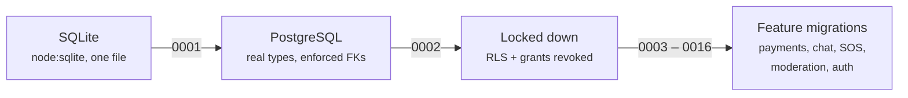
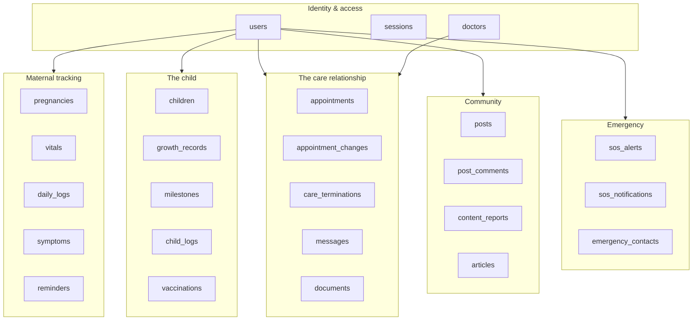
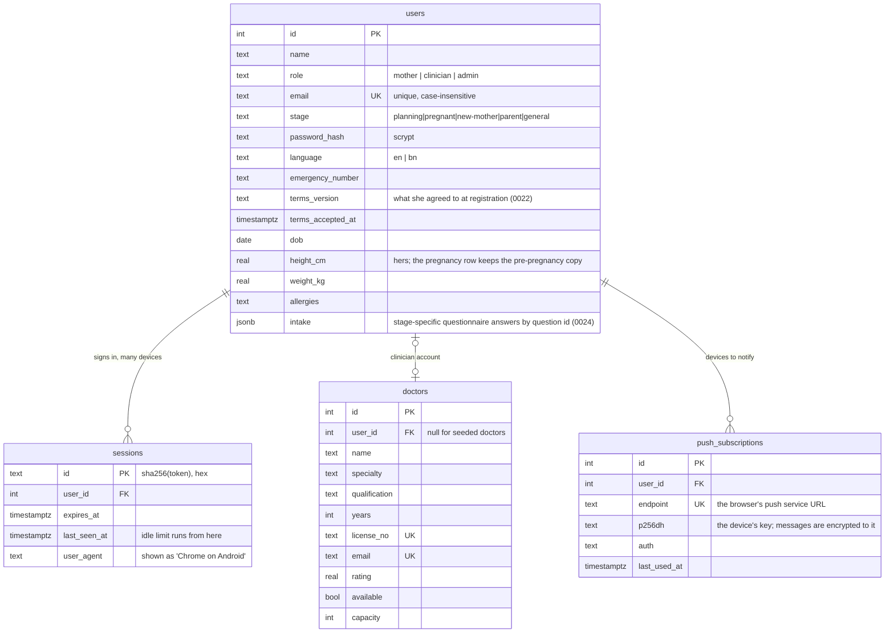
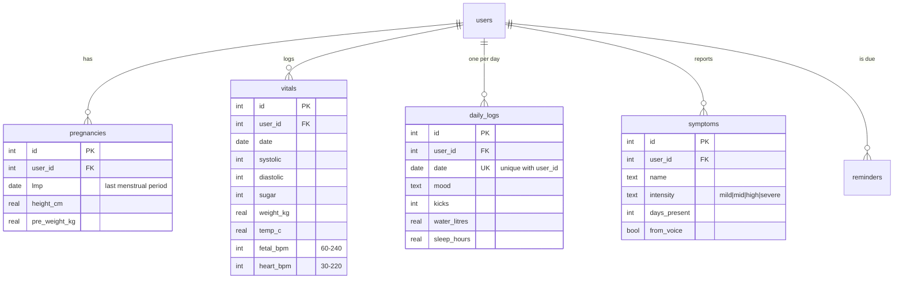
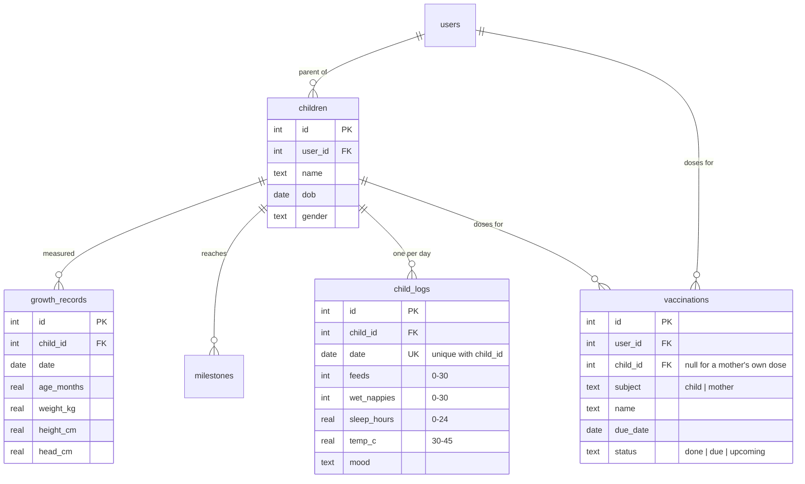
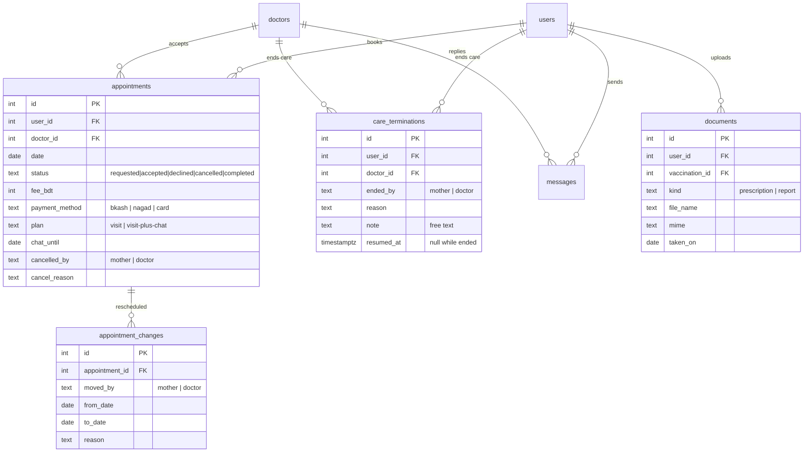
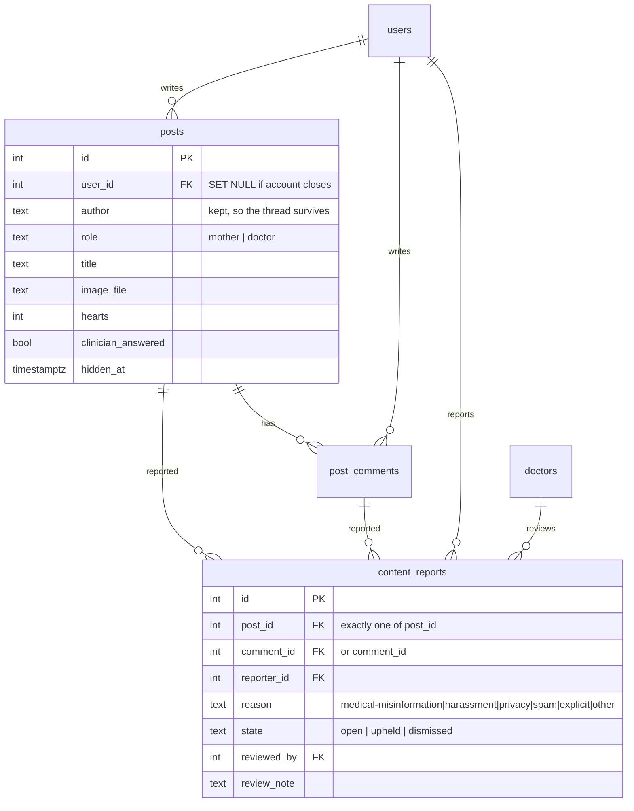
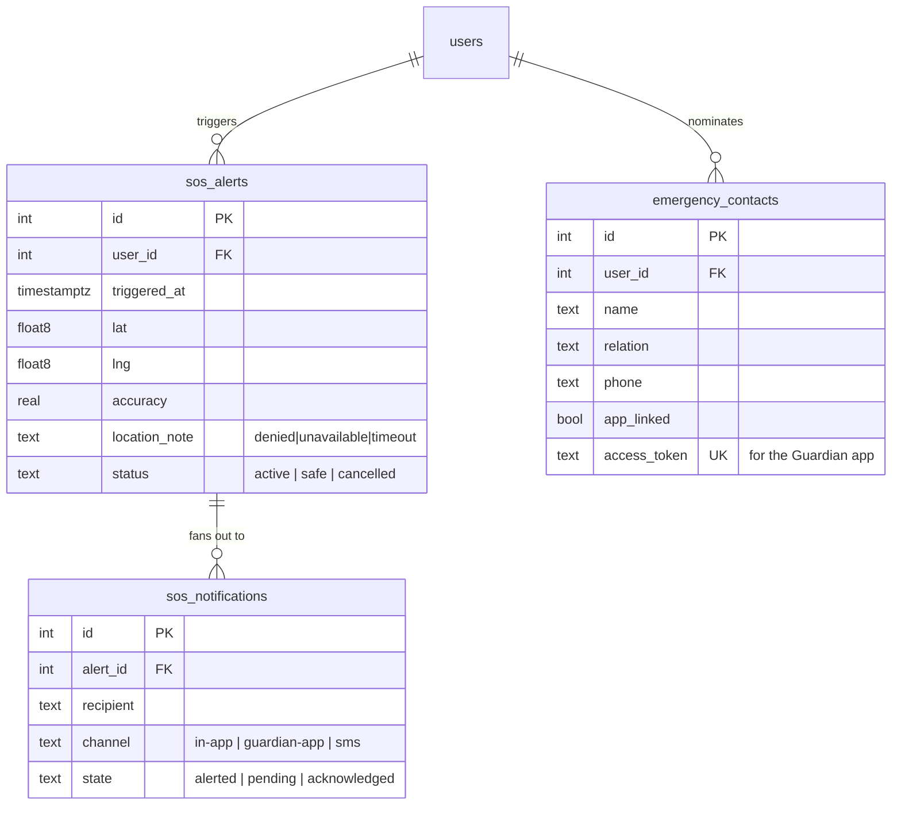

# The MaternalCare+ database

How this database is built, why it is shaped the way it is, and how to
recreate it from nothing.

For connection strings and Supabase settings, see **[SETUP.md](SETUP.md)**.
This file is about the *design*.

---

## At a glance

| | |
|---|---|
| Engine | PostgreSQL 17 (Supabase, region `ap-southeast-2`) |
| Driver | [`pg`](https://node-postgres.com) 8.23 — a connection pool, no ORM |
| Tables | 26 in the `public` schema |
| Foreign keys | 32, every one with an explicit `ON DELETE` rule |
| Check constraints | 38 |
| Unique constraints / indexes | 3 table-level, plus 7 partial unique indexes |
| Non-primary-key indexes | 29 |
| Built by | 16 numbered migrations in `db/migrations/` |

There is no ORM. Models issue SQL directly through `config/db.js`, which is a
thin wrapper over `pg` providing `sql()`, `one()`, `run()` and `tx()`. The
reason is that the domain logic here is mostly *aggregate* — "her last six
weeks of blood pressure, with the out-of-range ones flagged" — and that is
clearer as a query than as an object graph.

---

## How it was built

### 1. It started on SQLite

The first version used Node's built-in `node:sqlite`. That was quick to get
moving, but three things did not survive contact with real requirements:

- **SQLite has no real types.** Every date was `TEXT`, every flag `INTEGER`.
  Nothing stopped `'yesterday'` being stored in a date column.
- **Foreign keys were declared but not enforced** unless every connection set
  `PRAGMA foreign_keys=ON`. Orphan rows were possible, and happened.
- **It is a single file on one machine**, which rules out the clinician and
  the mother being on different devices at the same time.

### 2. The port to PostgreSQL

`0001_initial_schema.sql` is the port. Three things changed deliberately
rather than being copied across:

- **Real types.** `DATE`, `TIMESTAMPTZ`, `BOOLEAN`, `REAL`.
- **Enforced foreign keys**, each with a stated delete rule.
- **`CHECK` constraints** on every column with a fixed set of values.

The API contract did *not* change. `config/db.js` registers type parsers so
`DATE` still arrives as `'YYYY-MM-DD'` and `TIMESTAMPTZ` as an ISO string —
exactly what the React client and the Guardian app already parsed. `BIGINT`
(what `count(*)` returns) is parsed to a JS number, because every count in
this app is small and every caller expects one.



### 3. Locking it down (`0002`)

Supabase publishes the `public` schema through PostgREST, reachable with the
**anon key — which is public and ships inside client bundles.** With RLS off,
that key would read every patient record in this database.

This app never uses PostgREST. It connects as the table owner over `pg`, and
owners bypass RLS, so enabling RLS with no policies closes the REST door
completely while leaving the application untouched. Migration `0002` does both
halves:

```sql
-- every table gets RLS, denying by default
ALTER TABLE public.<t> ENABLE ROW LEVEL SECURITY;

-- and the PostgREST roles lose their grants entirely
REVOKE ALL ON ALL TABLES    IN SCHEMA public FROM anon, authenticated;
REVOKE ALL ON ALL SEQUENCES IN SCHEMA public FROM anon, authenticated;
```

Verified current state: `anon` and `authenticated` hold **no privileges on any
table**. Only `service_role` does, and that key never leaves the server.

### 4. Feature migrations (`0003`–`0016`)

Each numbered file adds one capability. They are applied in filename order and
are never edited after the fact — a mistake is corrected by a new file.

| Migration | Adds |
|---|---|
| `0003_paid_appointments` | fee, payment method and reference on appointments |
| `0004_plans_and_chat` | consultation plans, post-visit chat windows |
| `0005_daily_checkin` | `daily_logs` — one row per mother per day |
| `0006_vaccination_cards` | scanned cards linked to vaccination rows |
| `0007_doctors_register` | self-registration fields for clinicians |
| `0008_drop_hospitals` | removes the hospital directory *(not yet applied — see Known gaps)* |
| `0009_content_reports` | community moderation queue |
| `0010_reschedule_and_termination` | `appointment_changes`, `care_terminations` |
| `0011_maternal_heart_rate` | `vitals.heart_bpm`, distinct from the fetal rate |
| `0012_language` | `users.language` (`en` / `bn`) |
| `0013_child_daily_log` | `child_logs` — the child's daily row |
| `0014_vaccinations_per_user` | gives `vaccinations` an owner *(see below)* |
| `0015_authentication` | `users.password_hash`, the `sessions` table |
| `0016_accounts_and_doctor_links` | links `doctors` to clinician accounts |

> **`0014` is worth reading if you read only one.** `vaccinations` originally
> had no owner column, which meant it was one global list that every account
> read from and wrote to. Marking a dose given for one child marked it for
> every child in the system. The migration adds `user_id` and `child_id`, and
> the model now throws if it is ever called without a scope.

---

## Files in this folder

| File | What it is |
|---|---|
| `migrations/` | The 16 numbered files. **The source of truth.** |
| `schema.sql` | A consolidated snapshot of the *current* shape, for reading. Not applied by any script. |
| `seed.sql` | Demo data, with every date written relative to today |
| `reset.js` | Applies every migration in order (`npm run db:reset`) |
| `seed.js` | Loads `seed.sql` (`npm run db:seed`) |
| `seed-stages.js` | Adds the three life-stage demo mothers (`npm run db:stages`) |
| `seed-passwords.js` | Hashes a password onto every account (`npm run db:passwords`) |
| `seed-demo-patient.js` | One richly-populated patient for demos |
| `test-models.js` | 170 assertions against the real database (`npm run db:test`) |
| `audit-api.js` | End-to-end HTTP audit with a cookie jar (`npm run api:audit`) |
| `check.js` / `latency.js` / `bench.js` | Connection, round-trip and query timing |

`reset.js` runs **each migration inside its own transaction**, so a failure
leaves nothing half-applied.

---

## Design rules that recur

These conventions show up in almost every table, so they are worth stating
once rather than repeating per-table.

**1. Every foreign key states what happens on delete.**
There is no default. `CASCADE` means the row is meaningless without its
parent — her vitals cannot outlive her account. `SET NULL` means the row still
means something — a community post whose author closed their account is still
part of the conversation, so `posts.user_id` goes null and the stored
`author` name carries it.

**2. Fixed vocabularies are `CHECK` constraints, not application rules.**
`appointments.status` can only ever be one of five words. Enforcing that in
JavaScript means it holds only for code paths that remember to check; enforcing
it in the column means it holds for the seed script, a migration, and a
late-night `psql` session too.

**3. Clinical ranges are constraints as well.**
`vitals.fetal_bpm` must be 60–240; `heart_bpm` 30–220; `child_logs.temp_c`
30–45. These are not validation niceties. A transposed digit in a heart rate is
the kind of thing that should fail loudly at the database rather than be
charted as if it were real.

**4. "One per day" is a unique constraint.**
`daily_logs (user_id, date)` and `child_logs (child_id, date)` are unique, so
the day's entry is edited rather than duplicated. The models use
`INSERT … ON CONFLICT … DO UPDATE` and only overwrite the fields supplied,
which is what lets her fill in her mood in the morning and her sleep at night.

**5. Partial unique indexes express "unique when it applies".**

```sql
-- a mother may end care with a doctor many times over, but only one
-- ending can be the current one
CREATE UNIQUE INDEX care_terminations_active_key
    ON care_terminations (user_id, doctor_id) WHERE resumed_at IS NULL;

-- emails and licences are unique case-insensitively, and only when present
CREATE UNIQUE INDEX doctors_email_key   ON doctors (lower(email))       WHERE email       IS NOT NULL;
CREATE UNIQUE INDEX doctors_license_key ON doctors (lower(license_no))  WHERE license_no  IS NOT NULL;
CREATE UNIQUE INDEX users_email_key     ON users   (lower(email))       WHERE email       IS NOT NULL;

-- one report per person per item, so reporting is not a voting mechanism
CREATE UNIQUE INDEX content_reports_post_reporter_key
    ON content_reports (post_id, reporter_id)
    WHERE post_id IS NOT NULL AND reporter_id IS NOT NULL;
```

**6. Indexes follow the queries the app actually makes.**
`vitals (user_id, date DESC)` because every read is "her recent readings".
`messages (user_id, doctor_id, sent_at)` because every read is one thread.
`content_reports (state, created_at) WHERE state = 'open'` because the
moderation queue only ever looks at open reports.

---

## The schema

### Overview

Six clusters, all hanging off `users`.



### Identity and access

One `users` table holds mothers, clinicians and admins, separated by `role`.
A clinician has both a `users` row (how they sign in) and a `doctors` row (how
they appear in the directory), linked by `doctors.user_id`.

`sessions.id` is the **SHA-256 of** the session token (`0021`), not the token:
the random value lives only in the browser's httpOnly cookie, and a copy of
this table unlocks nothing. Signing out deletes the row, so a copied cookie
dies with it; so does `last_seen_at` falling more than a week behind (twelve
hours for a clinician), which is refused at lookup and swept daily.



`users.stage` is what drives the whole client. A woman planning a pregnancy, a
woman 29 weeks pregnant, a new mother and the parent of a two-year-old get
different dashboards, different daily questions and different guidance — all
keyed off this one column.

### Maternal tracking



**Only the LMP is stored.** Week number, trimester, due date and days remaining
are *derived* from `pregnancies.lmp` on every read. Storing a week number would
mean a row that is quietly wrong tomorrow; deriving it means it cannot be.

### The child



`growth_records` stores only the raw measurement. Percentiles are computed at
read time against the **WHO Child Growth Standards** LMS parameters (in
`models/data/whoGrowth.js`), using the curve for that child's sex — which is
why `children.gender` matters clinically and is not decoration.

`vaccinations` serves both mother and child, hence `subject` plus two nullable
owner columns.

### The care relationship



Rescheduling and termination are **kept as history, not as edits**. A moved
appointment writes an `appointment_changes` row rather than overwriting the
date, and ending care writes a `care_terminations` row with the reason and the
free-text note, rather than deleting the pairing. Booking again sets
`resumed_at` — the ending stays on the record.

### Community and moderation



A report points at **either** a post or a comment, never both and never
neither. That is a single constraint rather than application logic:

```sql
CHECK ((post_id IS NULL) <> (comment_id IS NULL))
```

`medical-misinformation` exists as its own reason because on a maternal health
board it is the category that matters most and sorts as urgent.

### Emergency



`location_note` records **why** there is no location — permission denied, GPS
unavailable, or timed out. An SOS with no coordinates and no explanation is
indistinguishable from one that was never sent.

`sos_notifications` is a row per recipient per channel, so the alert can
honestly report "2 alerted, 3 queued" instead of claiming everyone was reached.

---

## Building it from scratch

```bash
npm run db:reset       # apply all 16 migrations, in order
npm run db:seed        # demo data, dates relative to today
npm run db:stages      # the three extra life-stage mothers
npm run db:passwords   # hash a password onto every account
```

> `db:reset` is destructive — `0001` opens with `DROP TABLE … CASCADE`.
> Once there is data worth keeping, add a new numbered migration instead.

**`db:passwords` must be re-run after `db:stages`**, since new accounts arrive
without a hash and cannot sign in until they have one.

Then verify:

```bash
npm run db:check       # connection + round-trip latency
npm run db:test        # 170 assertions against the real database
npm run api:audit      # end-to-end HTTP audit with a signed-in cookie jar
```

---

## Known gaps

Recorded here rather than left to be discovered.

**`hospitals` still exists.** `0008_drop_hospitals.sql` is written but has not
been applied — the table is still present with 4 rows. Nothing reads it; the
app ranks individual clinicians and never lists hospitals. Apply the migration
to finish removing it.

**RLS is off on five tables.** `0002` enabled row-level security by looping
over the tables that existed *at that moment*. Five tables created by later
migrations — `appointment_changes`, `care_terminations`, `child_logs`,
`content_reports`, `sessions` — never got it.

This is a defence-in-depth gap rather than an active exposure: the other half
of `0002` revoked the PostgREST grants, and `anon` and `authenticated` still
hold no privileges on any table, so nothing is reachable through the REST API
regardless. Worth closing anyway, since `sessions` holds live tokens:

```sql
ALTER TABLE public.appointment_changes ENABLE ROW LEVEL SECURITY;
ALTER TABLE public.care_terminations   ENABLE ROW LEVEL SECURITY;
ALTER TABLE public.child_logs          ENABLE ROW LEVEL SECURITY;
ALTER TABLE public.content_reports     ENABLE ROW LEVEL SECURITY;
ALTER TABLE public.sessions            ENABLE ROW LEVEL SECURITY;
```

**The demo accounts all share a known password.** They are listed in the
project README and set by `seed-passwords.js`. A known password on a medical
record is the whole problem — every demo account must be removed before this
database holds anything real.
